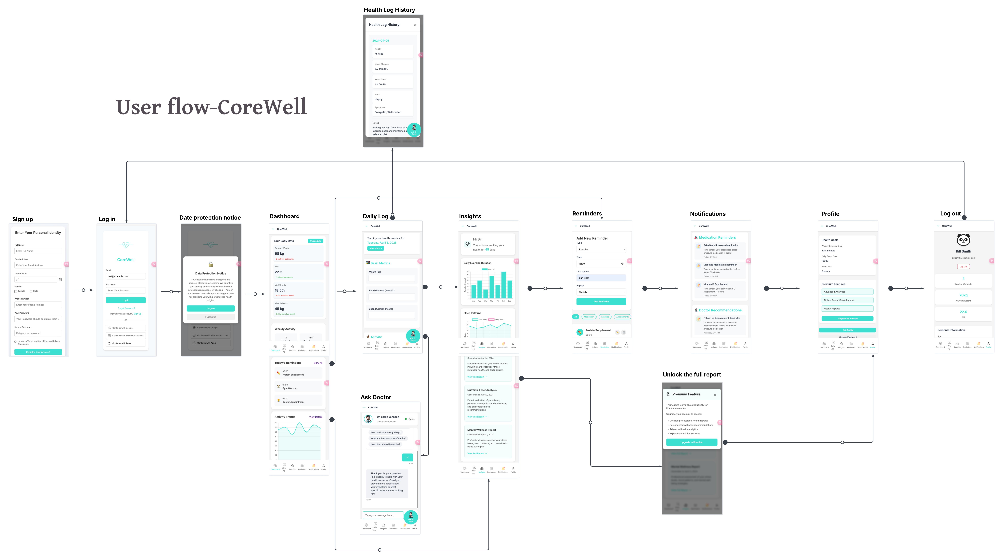

# CoreWell - Health Management System (Prototype)

## 📌 Overview
CoreWell is a working prototype of a health management system built using the MVC (Model-View-Controller) architecture. It allows users to input basic health information and receive a score/report based on internal logic. This prototype demonstrates modular structure, clean logic, and future expandability.

## 🚀 Features
- Web-based user interface (HTML templates + Flask)
- MVC structure separating logic, UI, and routing
- Local processing of health evaluation logic
- Ready for extension: database, APIs, user authentication

## 📂 Project Structure
```
CoreWell/
├── app.py                # Controller (Flask routes)
├── templates/            # View (HTML templates)
├── static/               # View assets (CSS, JS)
├── styles/               # Custom styles and images
├── convert_icons.py      # (Optional) file processing
├── requirements.txt      # Python dependencies
└── README.md             # Project description
```

## 🛠️ Requirements
- Python 3.8+
- pip

## 🔧 Setup Instructions
```bash
# Clone or unzip project
cd CoreWell

# (Optional) create virtual environment
python -m venv venv
source venv/bin/activate  # or venv\Scripts\activate on Windows

# Install dependencies
pip install -r requirements.txt

# Run the app
python app.py
```

Visit: http://127.0.0.1:5000

## 🧠 Architecture
Built on the MVC model:
- **Model**: core logic, may later access database/API
- **View**: HTML frontend displayed to users
- **Controller**: Flask routes handling requests and returning responses

## 🔮 Future Extensions
- Connect to external APIs (e.g., chronic disease prediction)
- Add database integration for health records
- Implement user login and session management

## System Design & Logic
Before coding, I mapped out the user journey and system logic to ensure a seamless experience.



